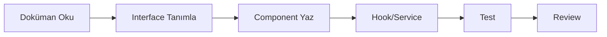

# 📱 Meslektaş Mobile - AI Agent Development Guide

> **AI-Optimized Documentation** - Kısa, öz, net. Sıfır şişirme, maksimum verimlilik.

## 🎯 Hızlı Başlangıç

Bu dokümantasyon AI agent'ların Meslektaş mobile app'ini hatasız geliştirmesi için tasarlandı.

```bash
# Proje dizini
cd mobile/

# Bağımlılıkları kur
npm install

# iOS Simulator başlat
npm run ios

# Android Emulator başlat
npm run android
```

## 📂 Dokümantasyon Yapısı

| Dosya                                              | Amaç                                              | Ne Zaman Oku                             |
| -------------------------------------------------- | ------------------------------------------------- | ---------------------------------------- |
| **[QUICK-REFERENCE.md](./QUICK-REFERENCE.md)**     | Ultra-compact cheat sheet                         | Hızlı pattern lookup                     |
| **[ARCHITECTURE.md](./ARCHITECTURE.md)**           | Folder yapısı, mimari patterns, data flow         | Yeni feature eklerken, yapı anlamak için |
| **[DEVELOPMENT-GUIDE.md](./DEVELOPMENT-GUIDE.md)** | TypeScript rules, component patterns, performance | Her kod yazarken, standartlar için       |
| **[API-INTEGRATION.md](./API-INTEGRATION.md)**     | Backend API kullanımı, auth, real-time            | API call yaparken, WebSocket kullanırken |
| **[COMMON-PATTERNS.md](./COMMON-PATTERNS.md)**     | Sık kullanılan kod patterns, hook'lar             | Implementation örnekleri için            |

## 🏗️ Tech Stack

```typescript
{
  framework: "React Native 0.81 + Expo 54",
  language: "TypeScript 5.3 (Strict Mode)",
  navigation: "React Navigation 6",
  stateManagement: {
    local: "Zustand 4",      // Auth, UI state
    server: "React Query 5"  // API data, cache
  },
  realtime: "STOMP over WebSocket",
  styling: "StyleSheet API + Theme System",
  forms: "React Hook Form + Zod"
}
```

## 🎨 Proje Yapısı (Özet)

```
mobile/src/
├── features/          # Feature modülleri (auth, feed, messaging...)
│   └── [feature]/
│       ├── screens/   # Ekranlar
│       ├── components/# Feature-specific components
│       ├── hooks/     # Feature hooks (useFeed, useAuth...)
│       ├── stores/    # Zustand stores
│       └── services/  # API services
│
├── core/              # Core utilities
│   ├── api/          # Axios client, interceptors
│   ├── navigation/   # React Navigation setup
│   ├── socket/       # WebSocket client
│   └── storage/      # Secure storage
│
├── shared/            # Shared utilities
│   ├── components/   # Reusable UI components
│   ├── hooks/        # Common hooks
│   └── utils/        # Helper functions
│
├── contexts/          # React Contexts (Theme, Locale, Toast)
└── theme/            # Theme system (colors, typography, spacing)
```

## ⚡ Kritik Kurallar

### 1️⃣ TypeScript - Strict Mode ZORUNLU

```typescript
// ❌ ASLA
const user: any = data;
function handlePress(item) { ... }

// ✅ HER ZAMAN
const user: User | null = data;
const handlePress = (item: Post): void => { ... };
```

### 2️⃣ Component Pattern - Standart Sıra

```typescript
export const Component: React.FC<Props> = ({ userId }) => {
  // 1. Hooks (useState, useTheme, vb.)
  const theme = useTheme();
  const [loading, setLoading] = useState(false);

  // 2. React Query / Zustand
  const { data } = useQuery(...);
  const user = useAuthStore(state => state.user);

  // 3. Effects
  useEffect(() => { ... }, []);

  // 4. Handlers (useCallback ile)
  const handlePress = useCallback(() => { ... }, []);

  // 5. Render
  return <View>...</View>;
};
```

### 3️⃣ Performance - Memoization ZORUNLU

```typescript
// Component memoization
export const PostCard = React.memo(({ post }: Props) => {
  // Callbacks
  const handlePress = useCallback(() => { ... }, [post.id]);

  // Expensive calculations
  const formatted = useMemo(() => format(post.date), [post.date]);

  return <Pressable onPress={handlePress}>...</Pressable>;
});

// FlatList optimization
<FlatList
  data={items}
  renderItem={renderItem}  // Memoized with useCallback
  keyExtractor={item => item.id}
  initialNumToRender={10}
  maxToRenderPerBatch={10}
  windowSize={5}
  removeClippedSubviews={true}
/>
```

### 4️⃣ Path Aliases - MUTLAKA Kullan

```typescript
// ❌ ASLA
import { Button } from '../../shared/components/Button';
import { useAuth } from '../../../features/auth/hooks/useAuth';

// ✅ HER ZAMAN
import { Button } from '@shared/components';
import { useAuth } from '@features/auth/hooks';
```

## 🔑 Temel Servisler

### API Client (`@core/api/client.ts`)

```typescript
import { apiClient } from '@core/api';

// GET
const { data } = await apiClient.get<User>('/api/users/me');

// POST
const { data } = await apiClient.post<Post>('/api/posts', { content: '...' });

// Token otomatik eklenir (interceptor)
// Error handling otomatik (interceptor)
```

### State Management

```typescript
// Zustand - Local State (auth, UI)
import { useAuthStore } from '@features/auth/stores/authStore';

const user = useAuthStore(state => state.user);
const login = useAuthStore(state => state.login);

// React Query - Server State (API data)
import { useQuery } from '@tanstack/react-query';

const { data, isLoading } = useQuery({
  queryKey: ['posts'],
  queryFn: () => api.getPosts(),
});
```

### Navigation

```typescript
import { useNavigation } from '@react-navigation/native';

const navigation = useNavigation();

// Navigate
navigation.navigate('PostDetail', { postId: '123' });

// Go back
navigation.goBack();

// Replace
navigation.replace('Home');
```

## 🚨 Sık Yapılan Hatalar

| Hata                    | Çözüm                                         |
| ----------------------- | --------------------------------------------- |
| `any` kullanmak         | Kesinlikle yok. TypeScript strict mode.       |
| Inline handlers         | `useCallback` kullan                          |
| Her render'da yeni obje | `useMemo` kullan                              |
| Relative imports        | Path aliases kullan (`@features`, `@core`)    |
| API error handling yok  | `apiClient` otomatik handle eder              |
| Platform-specific code  | `Platform.select()` veya `Platform.OS` kullan |

## 🔗 Backend Integration

**Base URL:** `http://localhost:8080` (development)

- Android Emulator: `http://10.0.2.2:8080`
- iOS Simulator: `http://localhost:8080`

**Auth:** JWT Bearer token (otomatik header'a eklenir)

**WebSocket:** STOMP over `/ws` endpoint

Detaylar için: [API-INTEGRATION.md](./API-INTEGRATION.md)

## 📋 Geliştirme Akışı



1. İlgili dokümantasyonu oku (ARCHITECTURE, DEVELOPMENT-GUIDE, vb.)
2. TypeScript interface'lerini tanımla
3. Component'i pattern'a göre yaz
4. Hook/service implement et
5. Çalıştır ve test et
6. Code review standartlarına uy

## 📊 Klasör Bazlı Feature Ownership

| Feature            | Klasör                    | Sorumluluk                    |
| ------------------ | ------------------------- | ----------------------------- |
| **Authentication** | `features/auth/`          | Login, register, logout       |
| **Feed**           | `features/feed/`          | Posts, comments, likes        |
| **Messaging**      | `features/messaging/`     | Real-time chat, conversations |
| **Profile**        | `features/profile/`       | User profile, edit            |
| **Verification**   | `features/verification/`  | AI verification flow          |
| **Notifications**  | `features/notifications/` | Push notifications, in-app    |

## 🎓 Öğrenme Yolu

1. **Yeni başlayan?** → `ARCHITECTURE.md` oku
2. **Component yazacaksın?** → `DEVELOPMENT-GUIDE.md` oku
3. **API entegrasyonu?** → `API-INTEGRATION.md` oku
4. **Pattern arıyorsun?** → `COMMON-PATTERNS.md` oku

## 💡 AI Agent Talimatları

**Bu dokümantasyon AI agent'lar için optimize edilmiştir:**

- ✅ Her dosya standalone, self-contained
- ✅ Kod örnekleri production-ready, copy-paste hazır
- ✅ Sıfır boilerplate, maksimum value
- ✅ Clear do's and don'ts
- ✅ Type-safe, strict TypeScript

**Kod yazarken:**

1. İlgili dokümantasyon dosyasını oku
2. Pattern'leri birebir takip et
3. TypeScript strict mode - istisna yok
4. Performance optimization - memoization zorunlu
5. Test et, çalıştığından emin ol

---

**Son Güncelleme:** 2024-12-09  
**Version:** 2.0 (AI-Optimized)  
**Maintainer:** Meslektaş Mobile Team
